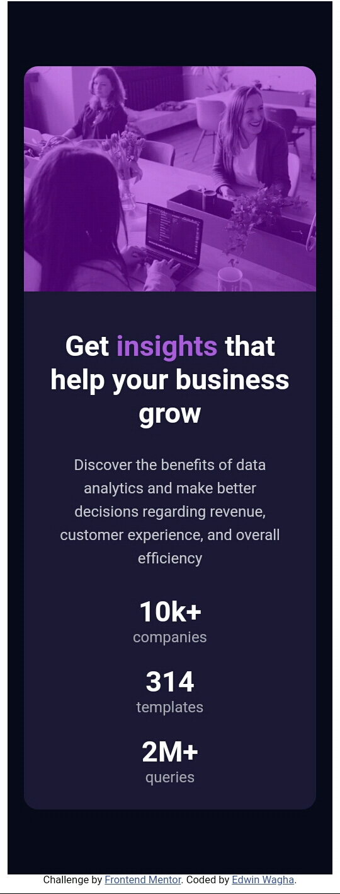
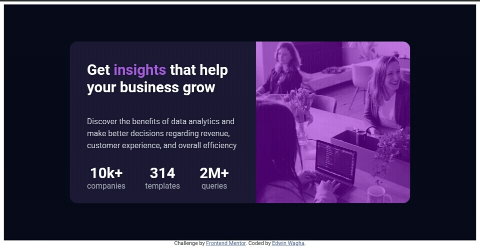

# Frontend Mentor - Stats preview card component solution

This is a solution to the [Stats preview card component challenge on Frontend Mentor](https://www.frontendmentor.io/challenges/stats-preview-card-component-8JqbgoU62). Frontend Mentor challenges help you improve your coding skills by building realistic projects. 

## Table of contents

- [Overview](#overview)
  - [Screenshot](#screenshot)
  - [Links](#links)
- [My process](#my-process)
  - [Built with](#built-with)
  - [What I learned](#what-i-learned)
  - [Continued development](#continued-development)
  - [Useful resources](#useful-resources)
- [Author](#author)
- [Acknowledgments](#acknowledgments)

## Overview


### Screenshot




### Links

- Live Site URL: [Add live site URL here](https://your-live-site-url.com)

## My process

### Built with

- Semantic HTML5 markup
- CSS custom properties
- Flexbox


### What I learned


```css
/*Color Variables*/
:root{
    --alphagreen:rgba(0,200,0,0.4);
  }
.color_change{
  color:var(--alphagreen);
  font-size:25px;
}
.height_property{
  height:fit-content;
}
}
```
```html
<!--variables make your workflow easy-->
<p class="color_change">Hello World,it's Ed here!</p>
```

### Continued development

The areas i wanna work on more before moving on to JavaScript ,are:
- flexboxes
- CSS Grid
- CSS Animations
- Sass and Scss files
  
  
### Useful resources

- [Background Image Overlay With Text](https://youtu.be/qKKXQepRIu0) - This helped me add the violet Overlay on-top of the header background image


## Author

- Frontend Mentor - [@EdTheDev](https://www.frontendmentor.io/profile/EdTheDev)
- Twitter - [@WaghaEdwin](https://www.twitter.com/WaghaEdwin)


